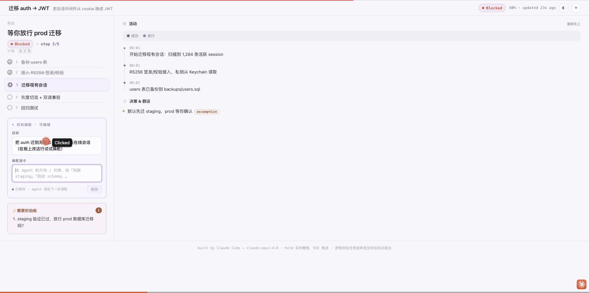

# 🧭 helm

> **Watch your coding agent work — and take the helm.**
> 一块 **实时、可操舵** 的单任务工作看板:agent 干活时你在浏览器里看着,随时在板上改目标,它下一步就跟上。


[](https://skills.sh/s/chasey-myagi/helm)

大多数"给 agent 看进度"的工具是**单向只读**的:你只能看,看到它跑偏也得等它跑完。helm 把看板从**显示器**变成**操舵台**——你在板上改「目标 / 操舵指令」,agent 在下一个检查点 `helm goal` 读到后跟着调整。不刷新、不闪烁、不常驻进程,每次更新只花几个 token。



> 一眼看完:agent 干活 → 遇岔口需你拍板(板子转红 + 通知你)→ 你在板上写一句操舵 → 它读到「照办」继续(只跑 staging)。这条「人中途改方向、agent 跟随」的回路,是 helm 和其它看板的根本区别。

## 你什么时候需要它?

- **长任务想盯着、又怕插不上手**:迁移 / 重构 / 脚手架 / 跑测试修一轮——你在另一个窗口干别的,余光扫一眼板就知道它在干嘛、卡没卡。
- **想中途纠偏而不打断它**:发现方向不对,直接在板上把「目标」改一行(「先只跑 staging」「别动 schema」),不用打断、不用重开对话,它自己跟上。
- **它该问你的时候主动喊你**:真需要拍板时,板上「需要你拍板」亮起,浏览器通知 + 标签标题 🔴 计数把你叫回来。

## 它交付什么?

一块开在 `127.0.0.1` 的**活看板**(两栏暖浅底 / 深色可切):

- **左栏常驻**:现在(当前动作 + 状态脉冲 + 进度)· 计划(步骤即进度)· **你的操舵**(可编辑目标 + 操舵指令,保存即回写)· 需要你拍板。
- **右栏流水**:活动时间线(彩色事件 + 图例,踩的坑也在这)· 决策 & 假设(假设带标记,便于你早纠偏)· 产物(链接 / 图片 / 数据)。

> 真实样例看 [`examples/sample-board.json`](examples/sample-board.json)(一块真实跑出来的 board 状态);本仓自身的开发就是用 helm 跟踪的——见 `examples/record-demo.sh` 复现一段 live demo。

## 快速开始

helm 是 **drop-in**:运行时零依赖,装好直接 `node` 跑,**不需要 `npm install`、不需要构建**。

```bash
# 装进各 agent 的 skills 目录
cp -r helm ~/.claude/skills/
cp -r helm ~/.codex/skills/        # 按各 runtime 实际目录
# 发布到 skills.sh 后亦可:  npx skills add chasey-myagi/helm
```

> ⚠️ 别把 CLI alias 成裸 `helm`——会和 Kubernetes 的 `helm` 撞名。用绝对路径调用即可(SKILL.md 已说明)。

## 触发方式

skill 按意图自动触发,你可以这样说:

- 「帮我做 X,边做边给我个**实时看板**看进度」
- 「我离开一会儿,弄个**看板**让我回来一眼看到你干到哪、还能**改方向**」
- 「这个迁移分几步,我想**盯着**、卡住了**叫我**」
- 「keep me posted on a **live board** while you refactor this」
- 「让我能**中途给你改目标**而不打断你」

## 示例

```bash
HELM=~/.claude/skills/helm/dist/helm.mjs

$HELM init --title "迁移 auth → JWT" --goal "把 auth 迁到无状态 JWT,不丢在线会话"   # 起服务 + 开浏览器
$HELM plan "备份 users" "接入 RS256" "迁移会话" "灰度切流" "回归"
$HELM step 2                                          # 1 done、2 active、进度自动算
$HELM event ok "users 表已备份"
$HELM decide "签名用 RS256" ; $HELM decide "默认先迁 staging" --assumption
$HELM goal                                            # 检查点:读你在板上改过的目标/操舵
$HELM ask "先迁 staging 还是 prod?"                    # 真阻塞 → 通知你
$HELM done "全部迁移完成,测试通过"
```

完整命令见 [`SKILL.md`](SKILL.md)。

## 它和同类有什么不同?

| | helm | [work-canvas](https://github.com/JingbiaoMei/work-canvas-skill) | [vibe-kanban](https://github.com/BloopAI/vibe-kanban) / [agent-kanban](https://github.com/saltbo/agent-kanban) |
|---|---|---|---|
| 形态 | **实时活看板(SSE)** | 跑完导出的静态 HTML 快照 | 实时看板 |
| 方向 | **双向**:你改目标,agent 跟随 | 单向只读 | 多为编排/认领 |
| 粒度 | **单任务**,聚焦一件事 | 单产物 | 多任务舰队 |
| 安装 | **零依赖 drop-in**(拷目录即跑) | paste 安装仪式 | `npx` 起服务 |

> 实时的有人做、静态自包含的有人做、多任务舰队的更是红海;但**「单任务 + 你中途改目标 agent 跟随」这条,helm 占着**。

## 安全边界

- **只写自己的状态**:helm 只写 `<project>/.helm/<task>/state.json` 并起一个本地只读看板服务,**不碰你的源码**、不发任何外部请求。
- **不常驻、不复活**:看板进程在没人看 / 长时间无更新时**自己退出**,从不开机自启、从不自我重启。
- **如实呈现**:agent 只能在检查点跟随你的操舵(它会主动 `helm goal`),不假装能中途被打断;假设项明确标 `assumption`,便于你早纠偏。

## 文件结构

```
helm/
├── SKILL.md            agent 怎么用它(触发 + 工作流 + 命令)
├── dist/               运行时产物(提交,纯 Node 零依赖):helm.mjs · server.mjs · board.html
├── src/                TypeScript 源:types.ts(共享 BoardState)· cli.ts · server.ts · board.ts
├── examples/           sample-board.json + record-demo.sh(可复现 demo)
├── PRODUCT/DESIGN/DEVRULES/ARCHITECTURE.md   产品 / 视觉 / 开发约束 / 技术设计
└── build.mjs · package.json · tsconfig*.json  (dev-only:esbuild + tsc)
```

改 `src/` 后 `npm run build` 出 `dist/`;开发约束见 [`DEVRULES.md`](DEVRULES.md),技术设计见 [`ARCHITECTURE.md`](ARCHITECTURE.md)。

## 验证与测试

- **浏览器端到端实测**:init → SSE 实时更新 → 页面改操舵 → `helm goal` 读到 → blocked 通知 → 进程自退,全过。
- **skill-creator eval 闭环**:3 个真实多步任务 × with/without skill 对比,**带 helm 时看板质量断言通过率 100%(22/22)vs 无 skill 13.7%**,且 agent 过程方差骤降(token ±0.5k vs ±9.4k)。

## License

[MIT](LICENSE) © 2026
